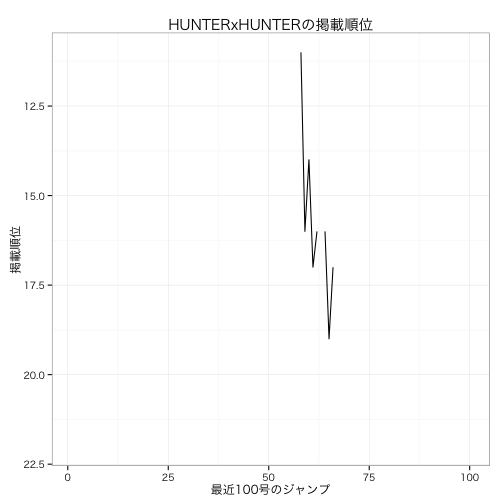

週間少年ジャンプの掲載順位データを作る(Rで)
===

## はじめに

[ジャンプの掲載順位データを可視化する](http://tosh1ki.github.io/data-an/2015/04/29/jump/)という素敵な記事がありました。

[ジャンプの掲載順位データ](http://hamada.tsukaeru.info/jump/)という大変素敵なHPから、pythonのbeautifulsoupでスクレイプしてデータを可視化する、といった内容でした。

同じことを、Rでやってみます。

作成されたデータは[Gist](https://gist.github.com/gghatano/238648d871e1fbd0c593)にあります。

## データの取得

スクレイプはrvestで、文字列処理はstringiでゴリゴリやりましょう。

まずはパッケージの準備。

```r
library(dplyr)
library(stringi)
library(rvest)
library(data.table)
```


```r
## 結果を入れるデータテーブル
jump_data = data.table(NULL)

## データがあるのは、1999年から2015年まででした。
for(year in 1999:2015) {
  ## リンクがまとまっているページのurl
  link_page =
    paste("http://hamada.tsukaeru.info/jump/", year, "/jump", year, ".html", sep="")
  link_page_html = html(link_page)
  
  ## アドレスを整形
  page_htmls = 
    link_page_html %>% 
    html_nodes(xpath="/html/body/ul/li/a") %>%
    html_attr("href") %>%
    stri_replace_all_regex("^./", paste("http://hamada.tsukaeru.info/jump/", year, "/", sep=""))
  
  ## ページの取得を行う
  for (page_html in page_htmls){
    ## 取得するページ
    print(page_html)
    jump_html = html(page_html) 
    
    ## 順位表を取得
    jump_table = 
      jump_html %>% 
      html_node(xpath="/html/body/table") %>% 
      html_table
    
    ## 年、号を取得
    jump_title_year_num = 
      jump_html %>% 
      html_node(xpath="/html/body/h2[1]")%>%
      html_text() %>% 
      stri_extract_all_regex(pattern = "\\d+") %>%
      unlist
    
    ## データの整形
    ## 掲載場所が書いてある列を知るために、表のサイズを取得
    jump_table_colnum = dim(jump_table)[2]
    jump_table_colnum
    jump_name_place = 
      jump_table %>%
      select(3, jump_table_colnum-1)
    ## 列名を英語で
    jump_name_place %>% setnames(c("name", "place"))
    ## 年、号、作品名、掲載順位というデータテーブルにします。
    jump_name_place_data = 
      jump_name_place %>%
      mutate(year = jump_title_year_num[1], 
             volume  = jump_title_year_num[2]) %>%
      select(year, volume, name, place)
    ## 結合
    jump_data = rbind(jump_data, jump_name_place_data)
    ## 今の年、号
    print(jump_title_year_num)
  }
}
## write.csv(jump_data, "jump_data.csv")
```

最後にちょっとだけゴミ掃除と調整。

ジャンプには合併号があるので、注意が必要です。

年間の通し番号を、新しく作っておきます。号数の歯抜けがなくすためです。


```r
## 出来たデータ使います 
jump_data = fread("jump_data.csv")
jump_data = 
  jump_data %>% 
  mutate(year = as.integer(year), volume = as.integer(volume)) %>%
  filter(!stri_detect_regex(name, pattern ="新連載作品")) 

## 合併号のところで、volumeが歯抜けになっていますので、
## volumeを、年ごとの通し番号にします。
jump_volume_data = 
  jump_data %>% 
  select(year, volume) %>%
  distinct(year, volume) %>% 
  group_by(year, add=FALSE) %>% 
  arrange(volume) %>% 
  mutate(volume_modified = row_number(.)) %>%
  ungroup()

## volumeを修正したものを反映させます
jump_data_modified = 
  jump_data %>%   merge(jump_volume_data, by = c("year", "volume")) %>% 
  select(year, volume_modified, name, place)

## 保存しておきます
jump_data_modified %>%
  write.csv("jump_data_modified.csv", 
            quote=FALSE, row.names=FALSE)
```

これで準備が整いました。

内容を確認してみます. 

食戟のソーマの掲載順位を見てみます. 


```r
## 食戟のソーマの掲載順位推移
jump_data_modified %>%
  filter(name == "食戟のソーマ")
```

```
## Source: local data table [115 x 4]
## 
##    year volume_modified         name place
## 1  2012              48 食戟のソーマ     1
## 2  2013               1 食戟のソーマ    13
## 3  2013               2 食戟のソーマ    12
## 4  2013               3 食戟のソーマ     8
## 5  2013               4 食戟のソーマ    13
## 6  2013               5 食戟のソーマ    14
## 7  2013               6 食戟のソーマ     6
## 8  2013               7 食戟のソーマ     4
## 9  2013               8 食戟のソーマ     9
## 10 2013               9 食戟のソーマ    11
## ..  ...             ...          ...   ...
```

最初の方は調子が悪かったみたいですね. 

## 掲載順位の可視化

掲載順位の可視化をやってみます. 

食戟のソーマの、掲載順位の推移を見てみましょう。

```r
library(ggplot2)
jump_data_modified %>% 
  filter(name == "食戟のソーマ") %>% 
  as.data.frame() %>%
  mutate(num = row_number()) %>%
  ggplot() +  
  geom_line(aes(x=num, y = as.integer(place))) + 
  scale_y_reverse() + 
  theme_bw(base_family = "HiraKakuProN-W3") + 
  ggtitle("食戟のソーマ 掲載順位の推移") + 
  ylab("掲載順位") + xlab("話数")
```

 

ちゃんとできているみたいですね。

## 順位が落ちた回

急に順位が落ち込んだ箇所が気になります. 

第何回で順位が落ちているか、調べてみましょう。

```r
jump_data_modified %>% 
  filter(name == "食戟のソーマ") %>% 
  as.data.frame() %>%
  mutate(num = row_number()) %>%
  mutate(place = as.integer(place)) %>% 
  arrange(desc(place)) %>% 
  head(10)
```

```
##    year volume_modified         name place num
## 1  2013               5 食戟のソーマ    14   6
## 2  2013               1 食戟のソーマ    13   2
## 3  2013               4 食戟のソーマ    13   5
## 4  2013               2 食戟のソーマ    12   3
## 5  2013              43 食戟のソーマ    12  44
## 6  2014              16 食戟のソーマ    12  65
## 7  2015               5 食戟のソーマ    12 102
## 8  2013               9 食戟のソーマ    11  10
## 9  2013              11 食戟のソーマ    11  12
## 10 2013              13 食戟のソーマ    11  14
```

最近だと、第102回で順位が落ちています。

手元の単行本で確認してみると、秋の選抜決勝で創真が「ぬかさんまの炊き込みご飯」をサーブする回でした。

どうせ最後に汁をぶっかけるんだろ、って感じでした。盛り上がりには欠けました。

## HUNTERxHUNTERの掲載順位

最後に、最近の100号分のジャンプで、HUNTERxHUNTERの掲載順位の推移を見てみましょう.


```r
jump_data_modified %>% 
  filter(name == "HUNTER×HUNTER") %>% 
  mutate(place_mod = as.integer(place)) %>% 
  tail(100) %>% 
  mutate(num = row_number()) %>% 
  as.data.frame() %>%
  ggplot() +  
  geom_line(aes(x=num, y = as.integer(place_mod))) + 
  scale_y_reverse() + 
  theme_bw(base_family = "HiraKakuProN-W3") + 
  xlab("最近100号のジャンプ") + 
  ylab("掲載順位") + 
  ggtitle("HUNTERxHUNTERの掲載順位") + 
  ylim(1,20) + 
  scale_y_reverse() 
```

```
## Scale for 'y' is already present. Adding another scale for 'y', which will replace the existing scale.
## Scale for 'y' is already present. Adding another scale for 'y', which will replace the existing scale.
```

 

仕事しろ

## まとめ

ジャンプの掲載順位データを整形してみました。

生存時間解析とかやってみたいですね。

以上です。


[](https://github2qiita.herokuapp.com/)
